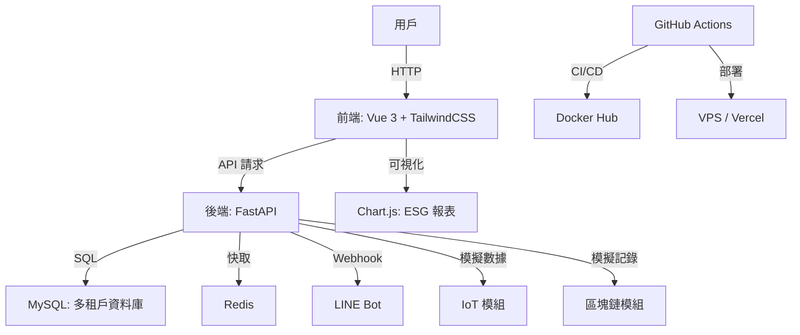

# AgriBridge SaaS 平台

**AgriBridge** 是一個模組化的農業 SaaS 平台，專為永續農業設計，旨在提升效率與透明度。結合 **多租戶架構**、**LINE Bot 通知**、**IoT 數據監測**、**區塊鏈交易追蹤** 與 **ESG 報表可視化**，為農民與買家提供數據驅動解決方案。本專案僅包含核心代碼，需手動安裝外部套件，確保系統穩定、可擴展，符合台灣工程師的務實需求。倉庫連結：[https://github.com/BpsEason/agribridge-saas.git](https://github.com/BpsEason/agribridge-saas.git)

## 核心功能
- **多租戶 SaaS 架構**：透過 `tenant_id` 實現數據隔離，確保農民、產品、訂單資料獨立。
- **LINE Bot 整合**：支援即時訂單通知，動態配置用戶 ID（開發環境模擬）。
- **IoT 數據監測**：模擬農場感測器數據（溫度、濕度），以 Chart.js 可視化。
- **區塊鏈交易追蹤**：模擬交易記錄，確保供應鏈透明。
- **ESG 報表可視化**：計算 ESG 分數，透過前端圖表展示永續指標。
- **CI/CD 自動化**：GitHub Actions 實現測試、檢查與部署。
- **安全認證**：JWT 認證，支援租戶級別訪問控制。
- **前端體驗**：Vue 3 搭配 TailwindCSS，打造響應式介面。

## 系統架構
採用模組化設計：
- **後端**：FastAPI 搭配 SQLAlchemy，MySQL 儲存數據，Redis 快取。
- **前端**：Vue 3 結合 Pinia 和 TailwindCSS，支援動態數據與圖表。
- **資料庫**：MySQL 以 `tenant_id` 隔離數據。
- **通知**：LINE Bot 支援即時推播與 webhook。
- **DevOps**：Docker 容器化，GitHub Actions 自動化 CI/CD，支援 Vercel 前端部署。

### 架構圖


## 技術棧
- **後端**：**FastAPI** (Python 3.11)、SQLAlchemy、PyMySQL、Redis、PyJWT、line-bot-sdk
- **前端**：**Vue 3**、Pinia、Vue Router、Axios、**TailwindCSS**、Chart.js、vue-toastification
- **資料庫**：**MySQL 8.0**
- **快取**：Redis 7.0
- **容器化**：**Docker**、Docker Compose
- **CI/CD**：GitHub Actions、Vercel（前端可選）
- **測試**：Pytest、Vitest、Flake8、Bandit、ESLint
- **其他**：Nginx（前端生產環境）、phpMyAdmin（資料庫管理）

## 專案結構
```
agribridge-saas/
├── api/                    # FastAPI 後端
│   ├── routes/            # API 路由（認證、農民、產品、訂單、IoT、區塊鏈）
│   ├── schemas/           # Pydantic 模型
│   ├── services/          # 業務邏輯（ESG 計算、模擬區塊鏈）
│   ├── models.py          # SQLAlchemy ORM 模型
│   ├── main.py            # FastAPI 入口
│   ├── requirements.txt   # Python 依賴
│   └── Dockerfile         # 後端 Docker 配置
├── frontend/               # Vue 3 前端
│   ├── src/               # Vue 程式碼
│   │   ├── views/         # 頁面（DashboardView、LoginView）
│   │   ├── components/    # 可重用組件
│   │   ├── router/        # Vue Router 配置
│   │   ├── stores/        # Pinia 狀態管理（認證）
│   │   └── api/           # API 客戶端工具
│   ├── package.json       # Node.js 依賴
│   ├── vite.config.js     # Vite 配置
│   └── Dockerfile         # 前端 Docker 配置
├── notification/           # LINE Bot 服務
├── docs/                  # API 與架構文件
├── tests/                 # 測試（Pytest、Vitest）
├── deploy/                # 部署配置
├── .github/workflows/     # CI/CD 流程
├── .env                   # 環境變數
├── docker-compose.yml     # Docker Compose 配置
├── LICENSE                # MIT 授權文件
└── README.md              # 專案說明
```

## 問與答（Q&A）
### 1. 專案概述與架構
**Q: AgriBridge 的目標、主要功能和解決的痛點是什麼？**  
A: AgriBridge 旨在提升永續農業效率與透明度，解決資訊不對稱、供應鏈透明度不足及環境數據管理困難等痛點。主要功能包括多租戶產品與訂單管理、LINE Bot 通知、IoT 數據監測、區塊鏈交易追蹤及 ESG 報表可視化，幫助農民優化運營，買家追蹤產品來源。

**Q: AgriBridge 的整體系統架構如何？各模組如何協作？**  
A: 系統採用模組化架構（見上方架構圖）。前端（Vue 3 + TailwindCSS）透過 HTTP 與後端（FastAPI）交互，後端處理業務邏輯，存取 MySQL（多租戶資料庫）和 Redis（快取）。LINE Bot 透過 webhook 發送通知，IoT 和區塊鏈模組模擬數據儲存至 MySQL，前端以 Chart.js 展示 ESG 和 IoT 數據。GitHub Actions 負責 CI/CD，自動化測試與部署。

**Q: 為什麼選擇 FastAPI 和 Vue.js？**  
A: FastAPI 提供高效能非同步 API，支援 Pydantic 驗證，適合高併發農業數據處理。Vue.js 輕量、響應式，搭配 Pinia 和 TailwindCSS，快速實現數據可視化。兩者開源生態活躍，降低維護成本，適合 SaaS 快速迭代。

**Q: 如何實現多租戶？對資料隔離和安全性有何影響？**  
A: 多租戶透過 MySQL 的 `tenant_id` 欄位實現，核心表（如 `tenants`, `farmers`, `products`, `orders`）包含此欄位。API 透過 JWT 驗證 `tenant_id`，確保數據隔離，防止跨租戶洩漏，提升安全性。

**Q: 使用了哪些第三方服務或 API？如何整合？**  
A: 使用 LINE Bot（通知）、Stripe 和 NewebPay（模擬支付）。LINE Bot 透過 `line-bot-sdk` 整合，FastAPI 處理 webhook 與推播，需配置 `LINE_CHANNEL_ACCESS_TOKEN` 和 `LINE_CHANNEL_SECRET`。支付模擬交易流程，數據儲存於 MySQL。

### 2. 後端 (FastAPI) 相關
**Q: FastAPI 如何設計 JWT 認證？Token 包含哪些資訊？**  
A: 使用 PyJWT 實現，用戶登入後生成包含 `user_id`, `tenant_id`, `role`, `exp` 的 Token，簽署用 `JWT_SECRET_KEY`。API 路由透過 `Depends(get_current_user)` 解碼，驗證 `tenant_id` 確保多租戶隔離。Token 存於前端 localStorage，請求攜帶於 `Authorization: Bearer <token>`。

**Q: 分離 api/routes/farmers.py 和 api/routes/auth.py 的好處？**  
A: 分離路由實現模組化，`farmers.py` 處理農民 CRUD，`auth.py` 專注認證邏輯，降低耦合，提升可維護性與可測試性，方便獨立擴展。

**Q: ESG 報告計算邏輯如何實現？如何擴展新指標？**  
A: 在 `services/esg_calculator.py`，根據銷售數據、IoT 環境數據（用水量）與治理數據（交易透明度）加權計算 ESG 分數，使用 Pandas 和 scikit-learn。擴展新指標需更新 `schemas/esg.py` 模型，新增計算函數，並調整前端 Chart.js 配置。

**Q: 如何處理 IoT 數據的即時性和歷史數據？**  
A: 模擬 IoT 數據（`services/iot.py`）定期生成並儲存至 MySQL 的 `iot_data` 表，Redis 快取最新數據降低資料庫壓力。歷史數據透過 SQLAlchemy 按時間查詢，前端 Chart.js 展示趨勢圖。

**Q: 區塊鏈模組的角色？未來整合考慮？**  
A: 模擬區塊鏈（`services/blockchain.py`）記錄交易哈希、時間戳、訂單 ID，儲存於 MySQL，展示供應鏈透明概念。未來整合（如 Ethereum）需考慮智能合約設計、Web3.py 整合、Gas 費用與私鑰安全。

**Q: api/main.py 環境變數驗證如何防止錯誤？**  
A: 使用 `pydantic_settings` 的 `BaseSettings` 驗證 `JWT_SECRET_KEY`, `DATABASE_URL` 等變數，啟動時檢查格式，缺失或錯誤會拋異常，防止配置錯誤。

**Q: create_initial_data 函數的作用？**  
A: 在 `api/main.py`，`create_initial_data` 於啟動時檢查並插入預設租戶與角色數據，確保首次部署或測試環境具備最小運行條件。

**Q: 後端訂單管理與 LINE 通知如何實現？**  
A: 在 `api/routes/orders.py`，訂單管理支援多租戶隔離與 LINE 通知。透過 POST `/api/v1/orders` 創建訂單，驗證 `tenant_id` 確保隔離，儲存至 MySQL 的 `orders` 表，使用 `line-bot-sdk` 推送訊息至 `line_user_id`，包含訂單詳情（如商品 ID、數量）。

### 3. 前端 (Vue.js) 相關
**Q: 前端如何處理登入、登出與 JWT 驗證？**  
A: `LoginView.vue` 透過 `axios.post('/api/v1/auth/login')` 提交帳密，獲取 JWT 存於 `localStorage`，Pinia（`stores/auth.js`）管理認證狀態。登出清除 `localStorage` 和 Pinia 狀態，重定向至登入頁。API 請求攜帶 `Authorization: Bearer <token>`。

**Q: DashboardView.vue 如何處理錯誤？為什麼重要？**  
A: 使用 `vue-toastification` 顯示錯誤提示，`try-catch` 包裝 `axios` 請求，失敗時觸發 toast（如 `this.$toast.error('載入數據失敗')`）。這提供清晰用戶反饋，提升體驗，便於除錯。

**Q: DashboardView.vue 如何整合 Chart.js？**  
A: 在 `DashboardView.vue`，透過 `axios.get('/api/v1/esg-report')` 獲取 ESG 數據，於 `onMounted` 勾子使用 Chart.js 渲染柱狀圖，展示環境、社會、治理分數。配置 `type="module"` 確保 ES 模組相容，`responsive: true` 適應不同設備。

**Q: 前端顯示區塊鏈交易記錄時關注哪些數據點？**  
A: 顯示交易哈希、時間戳、訂單 ID 和租戶 ID，透過 `axios.get('/api/v1/blockchain-transactions')` 獲取，於表格展示，增強供應鏈透明度。

**Q: LINE 通知如何實現動態用戶 ID 輸入和驗證？**  
A: `NotificationView.vue` 提供輸入欄，透過 `axios.post('/api/v1/notifications/send-line-message')` 發送用戶 ID，後端驗證格式並記錄於 `users` 表，使用 `line-bot-sdk` 推播訊息。

**Q: Pinia 狀態管理的優點是什麼？**  
A: Pinia 輕量、支援 Composition API，語法簡潔，與 Vue DevTools 整合良好，便於除錯與狀態追蹤，適合管理認證與數據狀態。

**Q: 前端的 API 請求如何統一管理？**  
A: 在 `frontend/src/api/index.js`，使用 `axios.create` 定義基礎 URL 和標頭（如 `Authorization`），各模組（如 `auth`, `orders`）獨立函數，降低耦合，方便維護。

### 4. DevOps 與部署
**Q: CI/CD 管線的各階段負責什麼？**  
A: `.github/workflows/ci.yml` 包含：
- **Linting**：Flake8、Bandit（後端），ESLint（前端）檢查程式碼。
- **Testing**：Pytest（後端），Vitest（前端）執行測試。
- **Build**：建構 Docker 映像。
- **Push**：推送至 Docker Hub。
- **Deploy**：透過 SSH 部署至 VPS 或 Vercel。

**Q: 為什麼採用多階段 Dockerfile？**  
A: 多階段 Dockerfile（`api/Dockerfile`, `frontend/Dockerfile`）分建構與運行階段，減少映像大小（約 30-50%），移除不必要工具，提升安全性。

**Q: Docker Compose 配置包含哪些服務？為什麼需要健康檢查？**  
A: 包含 `api`（FastAPI）、`frontend`（Vue 3）、`mysql`、`redis`、`phpmyadmin`。健康檢查（`healthcheck`）確保服務啟動正常（如 MySQL 可連線），避免依賴未就緒。

**Q: 如何在 CI/CD 中執行測試？**  
A: 後端使用 Pytest（`pytest tests/api/`），前端使用 Vitest（`npm run test`），CI 環境設置 MySQL 和 Redis 容器，確保測試隔離。

**Q: Vercel 如何用於前端部署？**  
A: `frontend/vercel.json` 定義路由與環境變數，`vercel --prod` 部署 Vite 建構輸出（`dist/`），提供 CDN 和 HTTPS 支援。

### 5. 軟體工程實踐
**Q: 專案如何體現模組化設計？**  
A: 後端路由分離（`routes/`）、前端組件化（`components/`, `views/`）及服務分離（LINE Bot、IoT），降低耦合，方便維護與擴展。

**Q: 如何確保可測試性？**  
A: 使用 Pytest 和 Vitest 編寫單元與整合測試，依賴注入與 mock 技術確保隔離，CI 強制執行測試。

**Q: 開發過程中遇到哪些挑戰？如何解決？**  
A: 挑戰包括多租戶隔離（用 `tenant_id` 過濾）、LINE webhook 配置（用 ngrok 測試）、IoT 數據模擬（定時任務與 Redis 快取）、API 一致性（Pydantic 與 OpenAPI 文件）。

**Q: 若有更多時間，會優先改進什麼？**  
A: 實現真實區塊鏈整合（如 Ethereum）與 IoT 即時數據流，提升交易透明度與數據價值。

## 環境需求
- **Docker** 與 **Docker Compose**（推薦）
- **Python 3.11+**（本地後端開發）
- **Node.js 18+**（本地前端開發）
- **Git**
- **LINE 開發者帳戶**（LINE Bot 整合，開發環境可選）
- **MySQL 8.0**（資料庫）
- **Redis 7.0**（快取）

## 安裝與設置
本專案僅提供核心代碼，外部套件需手動安裝。以下為詳細步驟：

1. **複製儲存庫**：
   ```bash
   git clone https://github.com/BpsEason/agribridge-saas.git
   cd agribridge-saas
   ```

2. **安裝系統級依賴**（若不使用 Docker）：
   - **Python 3.11**：
     ```bash
     # Ubuntu/Debian
     sudo apt update
     sudo apt install python3.11 python3-pip
     ```
     ```bash
     # macOS (via Homebrew)
     brew install python@3.11
     ```
   - **Node.js 18**：
     ```bash
     # Ubuntu/Debian
     curl -fsSL https://deb.nodesource.com/setup_18.x | sudo -E bash -
     sudo apt install -y nodejs
     ```
     ```bash
     # macOS (via Homebrew)
     brew install node@18
     ```
   - **MySQL 8.0**：
     ```bash
     # Ubuntu/Debian
     sudo apt install mysql-server
     sudo systemctl start mysql
     ```
     ```bash
     # macOS (via Homebrew)
     brew install mysql
     brew services start mysql
     ```
   - **Redis 7.0**：
     ```bash
     # Ubuntu/Debian
     sudo apt install redis-server
     sudo systemctl start redis
     ```
     ```bash
     # macOS (via Homebrew)
     brew install redis
     brew services start redis
     ```

3. **設置環境變數**：
   - 複製 `.env` 範本：
     ```bash
     cp .env.example .env
     ```
   - 更新 `.env`：
     - `JWT_SECRET_KEY`：執行 `openssl rand -base64 32` 生成。
     - `MYSQL_ROOT_PASSWORD`、`MYSQL_USER`、`MYSQL_PASSWORD`：設置 MySQL 帳密。
     - `DATABASE_URL`：格式為 `mysql+pymysql://<user>:<password>@<host>:3306/<database>`。
     - `REDIS_URL`：格式為 `redis://<host>:6379/0`。
     - `LINE_CHANNEL_ACCESS_TOKEN`、`LINE_CHANNEL_SECRET`：從 LINE 開發者控制台取得（開發環境可模擬）。
     - `STRIPE_API_KEY`、`NEWEPAY_API_KEY`：開發環境使用模擬值。

4. **安裝後端依賴**：
   - 進入 `api/`：
     ```bash
     cd api
     ```
   - 安裝套件（依 `requirements.txt`）：
     ```bash
     pip install --no-cache-dir fastapi[all] uvicorn pandas scikit-learn redis python-dotenv \
     SQLAlchemy PyMySQL pydantic_settings numpy matplotlib PyJWT cryptography \
     python-multipart beautifulsoup4 requests html5lib psutil uvloop httpx line-bot-sdk
     ```
     - 若有依賴衝突，使用虛擬環境：
       ```bash
       python -m venv venv
       source venv/bin/activate  # Linux/macOS
       .\venv\Scripts\activate   # Windows
       pip install -r requirements.txt
       ```

5. **安裝前端依賴**：
   - 進入 `frontend/`：
     ```bash
     cd frontend
     ```
   - 安裝套件（依 `package.json`）：
     ```bash
     npm install axios pinia pinia-plugin-persistedstate vue vue-router vue-toastification \
     chart.js vue-chartjs @vitejs/plugin-vue @vue/test-utils @vitest/coverage-v8 \
     vite autoprefixer postcss tailwindcss vitest @vue/eslint-config-prettier eslint \
     eslint-plugin-vue prettier
     ```

6. **初始化資料庫**：
   - 啟動 MySQL 並建立資料庫：
     ```bash
     mysql -u root -p
     CREATE DATABASE agribridge_db;
     ```
   - 執行初始數據腳本：
     ```bash
     cd api
     python -c "from main import create_initial_data; create_initial_data()"
     ```

## 運行應用程式
1. **使用 Docker Compose（推薦）**：
   ```bash
   docker-compose up --build -d
   ```
   - 前端：`http://localhost:5173`
   - API：`http://localhost:8000/api/v1`
   - phpMyAdmin：`http://localhost:8080`

2. **本地運行**：
   - 後端：
     ```bash
     cd api
     uvicorn main:app --host 0.0.0.0 --port 8000 --reload
     ```
   - 前端：
     ```bash
     cd frontend
     npm run dev
     ```

3. **停止服務**：
   ```bash
   docker-compose down
   ```

## LINE Bot 配置
1. 在 LINE 開發者控制台建立官方帳號，取得 `LINE_CHANNEL_ACCESS_TOKEN` 和 `LINE_CHANNEL_SECRET`。
2. 更新 `.env` 文件。
3. 設定 webhook URL 為 `http://<your-domain>/api/v1/line-webhook`。
4. 測試通知（前端儀表板或 `/api/v1/notifications/send-line-message`）。

## 測試
- **後端測試（Pytest）**：
  ```bash
  cd api
  pytest ../tests/api/
  ```
  - 涵蓋認證、農民、產品、訂單、財務、IoT、區塊鏈與 LINE 通知。
- **前端測試（Vitest）**：
  ```bash
  cd frontend
  npm run test
  ```
  - 測試 `LoginView.vue` 與 `DashboardView.vue`（產品、訂單、IoT、區塊鏈）。
- **程式碼檢查**：
  - 後端：
    ```bash
    cd api
    pip install flake8 bandit
    flake8 .
    bandit -r .
    ```
  - 前端：
    ```bash
    cd frontend
    npm run lint
    ```

## 部署
- **Docker 部署**：
  - 使用 `docker-compose.yml` 搭配 Nginx 反向代理。
  - 確保 `.env` 安全。
- **Vercel（前端）**：
  - 執行：
    ```bash
    cd frontend
    npm install -g vercel
    vercel --prod
    ```
- **VPS 部署**：
  - 配置 VPS 的 Docker Compose，使用 CI/CD 自動部署。

## 常見問題（FAQ）
**Q: 前端報錯 `Uncaught SyntaxError: Cannot use import statement outside a module` 怎麼解決？**  
A: 這表示 JavaScript 文件未被識別為 ES 模組。請檢查：
1. **確認 `<script>` 標籤**：確保 `frontend/index.html` 包含 `type="module"`：
   ```html
   <script type="module" src="/src/main.js"></script>
   ```
2. **檢查 Vite 配置**：確認 `frontend/vite.config.js`：
   ```javascript
   import { defineConfig } from 'vite';
   import vue from '@vitejs/plugin-vue';

   export default defineConfig({
     plugins: [vue()],
     server: {
       port: 5173,
     },
   });
   ```
3. **檢查 package.json**：確保 `frontend/package.json` 包含 `"type": "module"`：
   ```json
   {
     "type": "module",
     "scripts": {
       "dev": "vite",
       "build": "vite build",
       "test": "vitest"
     }
   }
   ```
4. **Vue 檔案**：確認 Vue 檔案（如 `DashboardView.vue`）的 `<script>` 包含 `type="module"`。
5. **清除快取**：執行 `npm cache clean --force` 並重新運行 `npm install`。
6. **使用 Vite 伺服器**：透過 `npm run dev` 運行前端，Vite 自動處理模組解析。若問題持續，檢查瀏覽器控制台或使用 `ngrok` 測試本地部署。

## 貢獻指南
1. Fork 儲存庫。
2. 建立分支（`git checkout -b feature/your-feature`）。
3. 提交變更（`git commit -m "Add your feature"`）。
4. 推送分支（`git push origin feature/your-feature`）。
5. 提交 Pull Request。

## 授權
本專案採用 MIT 授權，詳見 `LICENSE` 文件。

---

**AgriBridge** - 以 **FastAPI**、**Vue 3**、**TailwindCSS**、**Docker** 和 **MySQL** 打造永續農業平台，實現 **多租戶**、**LINE Bot**、**IoT**、**區塊鏈** 與 **ESG 可視化** 的高效生態系統。
